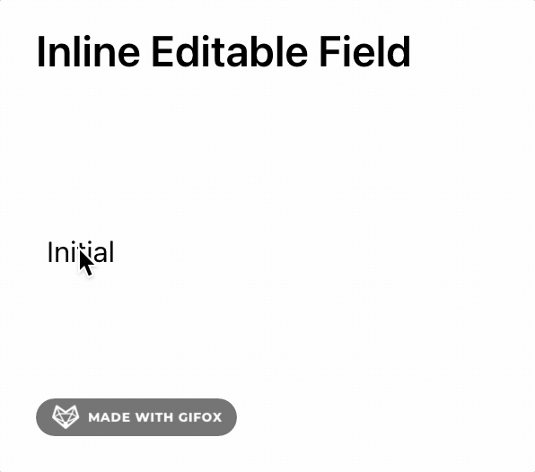

# Inline Editable Field using Formik

This repo contains a **headless** component wrapping the [**Formik**](https://formik.org) `<Form />` component and takes care of all the necessary state logic and event handlers for an **inline editable field**. 

*Why?* - I had a hard time to find a simple, elegant hand headlesss implementation, and decided to build a component myself.

## ▶️ Demo

## How can I use this?
Take a look at `<InlineEditableForm/>` [src/App.tsx](src/App.tsx) for to exact component.

## ⭐️ Main Features ⭐️:

- ✅ Headless form component, use your own styling
- ✅ Keyboard (Tab, Enter, Esc) and mouse interaction
- ✅ Autosubmit on blur
- ✅ Works with Formik
